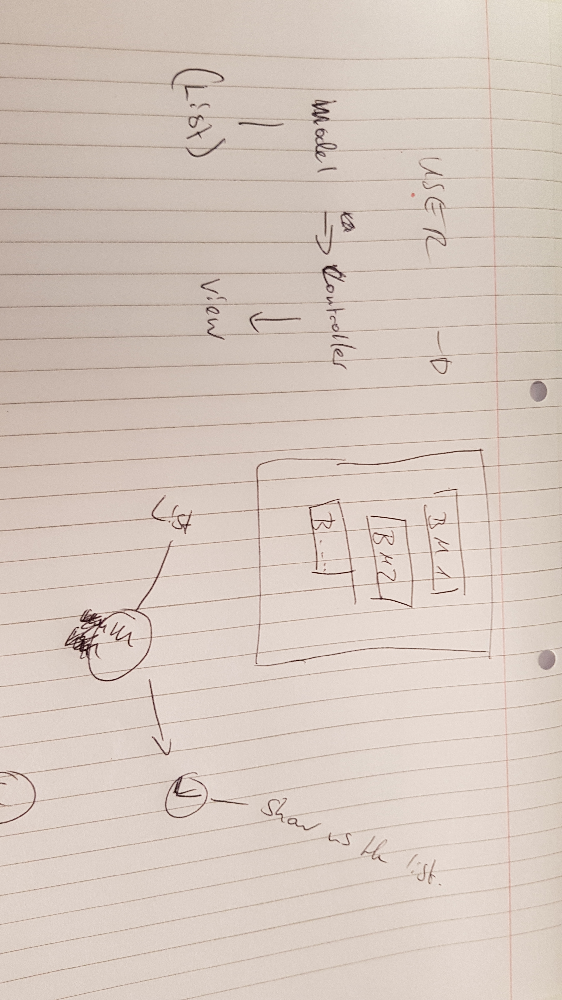

Requirements
-----------

* Show a list of bookmarks
* Add new bookmarks
* Delete bookmarks
* Update bookmarks
* Comment on bookmarks
* Tag bookmarks into categories
* Filter bookmarks by tag
* Users manage their bookmarks

User stories
----
```
As a user
So I can remember pages I want to visit again 
I want to be able to see a list with the names of the pages I've saved

As a time-pressed user
So that I can save a website
I would like to add the site's address and title to bookmark manager
```

Domain Model



## How to use

### To set up the project

Clone this repository and then run:

```
bundle
```

### To run the Bookmark Manager app:

```
shotgun -p 4567
```

### To run tests:

```
rspec
```

### To run linting:

```
rubocop
```
